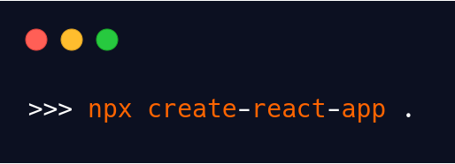

Before we wander off into the world that is ReactJS, I just want to let you guys know that this is my first blog post. So the fact that you’re reading this means the world. As this is my first post I thought it would be best to start with my favourite frontend library, ReactJS. Whether you are a beginner or just someone that wants to build a very simple React application, then this is the blog post for you.

# What we're going to build

For this tutorial, we will be developing a very basic React application, where a user will be able to input a value which will be used to increment or decrement a current count. Basically, an extremely simple calculator that can only perform addition and subtraction. We won’t just be going over ReactJS but also some CSS!


> The source code for this tutorial can be found on my [GitHub](https://github.com/sixfwa/react-project-1)

This tutorial will not be going over the nitty-gritty details of React. Instead, we’re just going to go head first into development, with little bits of information along the way.

# Setting up the React App

I am going to go with the assumption that you already have *create-react-app* and *npx* installed. If not, then at the bottom of this page you’ll find a link that should help with the installation process.

To start with, jump into the terminal and *cd* into your preferred directory. Then enter the following and hit Enter.



This command will set up your development environment where you will be able to start building the React application. One of the great things about *create-react-app* is that you don’t need to install or configure tools such as webpack or Babel, but instead focus on the code.

The “.” in the above snippet means that a React application will be generated and named after the directory you are currently in. Now, to ensure that everything has been installed properly. Run the command shown below:


If setup was successful your browser will open up on [http://localhost:3000/](http://localhost:3000/) displaying the React logo along with some content.

# Development

Now that we have the boilerplate code, we can start building the application. The first thing to do is to open up your favourite text editor (VSCode is the best) and then the directory containing the React application. From there, navigate to the *App.js* file. This file contains the *App* component which acts as the container for all other components.

Remove all the necessary lines of code until your *App.js* file looks like the one shown below.


We have removed the imports and styles and also emptied the body of the _return_ statement and added a _h1_ tag which will display the name of the application. Standard HTML stuff.

Now we can move onto creating the core part of the application. Within your _src_ folder, create a new directory called _components_. Within that folder create a file called _Counter.js_ and add the boiler plate code for the component as shown below:


Within the return statement, we have the mandatory div tag to encapsulate the rest of the component. We added an input field that can only receive a number, which is done by specifying type as “number”. We also added a placeholder to give users a bit of guidance on what to enter.

Then we have the two buttons, “-” and “+”. We will add functionality in the next step, where the “-” button will decrement the _count_ by the _value_ specified in the input field, whereas the “+” button will increment the _count_ by said amount.

You’re probably wondering why there is a <div> between the two buttons. This will later be used to show the current count which will be set up in the next step.

## Adding Functionality

Now it would be a pretty boring app if it didn’t do anything apart from look the part. In this section we will add functionality so that the app can increment and decrement a _count_ by a given _value_. We will add the following lines shown in colour in the snippet below:


To start with, we import the React hook _useState_, which will allow us to have a state variable in our functional component _Counter_. To make use of this we write the line shown opposite, containing the _const [count, setCount]_.

In English, what this line means is that we want to have a count which we will initially set to 0. Therefore, every time the application has mounted, the count will be set to 0. We are also telling the system that we want a function _setCount_ which will allow us to change the value of _count_. The _count_ has also been added, which is shown within the _div_ tag.

Similar to what we did with _[count. setCount]_, we will do the same for _[value, setValue]_. _Value_ is initialised to the value 1 and will be used to increment or decrement the _count_. The code is shown in the snippet below:


Now that we have set up the two states required for this component, it’s time that we put them to use. To start with, we want the _value_ to be set to whatever the user enters in the input field. This is done shown in the code below:


As you can see, we have modified the _input_ tag so that it now holds the attribute _onChange_. This attribute refers to a callback function which takes _e_ (_event_) as a parameter.

In plain English, this callback function is telling the system that it must set the state of _value_ to the number that has been entered. The _value_ variable is then set using _setValue_.

As the input value is a string, we will use the _parseInt()_ function to convert the value into an integer. Without this function, we would not be able to perform addition properly, as it would instead be concatenating the value. The parameter passed into _parseInt_ is as follows:

```jsx
setValue(parseInt(e.target.value || 0))
```

This is telling the React application to set the state of _value_ to whatever number that is currently in the input field. However if a no number exists, then set the state of _value_ to 0. This is to ensure that _value_ is never set to _NaN_.

## Increment and Decrement

As stated earlier, we want the “-” button to decrement the _count_ by the _value_ and the “+” button to increment the _count_. As we have the _setCount_ function, implementing this feature is quite straight forward and is shown in the code snippet below:


We have modified the two buttons so that they now include the property _onClick_. For _onClick_ we pass in a callback function which points to _setCount_. For the “-” button, it is telling the system that when someone clicks this button, it wants it to call the _setCount_ method which will subtract the _value_ from the current _count_. Similarly for the “+” button, but instead perform addition.

In terms of functionality, that’s the Counter component done. To see that it is working properly we need to import it and then implement it into App.js. The lines added are shown in green in the code snippet below:


All we have done is imported the *Counter* into *App.js* and then placed it just below our *h1* tag.

Okay, that’s the React side done. Now it’s time to focus on styling the app, as right now it’s pretty bland.

# Styling the App

Let’s first start by giving the background some colour. Jump into the _index.css_ file and within the body section add the line shown at the bottom of this snippet:


For those that are not so familiar with CSS, what we are doing here is just setting the background colour to _wheat_.

```css
background-color: wheat;
```

When it comes to styling in ReactJS, there are a couple of ways in which we can do this. For this tutorial, we will cover two different methods. The first one is to create a corresponding CSS file to _Counter.js_.

In the components directory, create a file called _counter.css_, which will contain the styles for the Counter component. Before writing these styles we first need to add the class names within Counter. These will be used as reference points for **\***counter.css* so that it knows what areas to target. The code snippet below will show what changes need to be made in *Component.js\*, where the changes are shown in green.


First, we import the CSS file we have created for the _Counter_ component, which will now allow us to style the component from within _counter.css_. Next we add all the relevant class names, with the first one being _container_. This will act as a box that will contain the input field, the counter display and the two buttons. Then we add the class names _button_ and _count_, In order for us to style each of those.

A class name was not added for the input field as I want to give an example as to how we can style an HTML tag without the use of a class. However it is good practice to add classes where possible.

Now that we have the added the class names, we can start writing the CSS code. Let’s jump back into _component.css_.

## Container CSS

As many of us browse the web via our phones, it would be a good idea to make this application as responsive as possible. We could do this using CSS flexbox, however for this tutorial we will instead use Grid. The code snippet below shows the styles used to design the _container_.


With the grid, we structured it so that there are three columns and two rows, with a gap between each item being _2rem_. The text and content within the container are then centred using _text-align_ and _justify-content_.

## Input CSS


Now for the input field, this will cover each of the three columns in the first row. This is done using _grid-column-start_ and _grid-column-end_. The great thing about doing this is that the other components, the buttons and the count display, will organise themselves automatically. As their positioning is relative to the input field.

## Count CSS

For this we just want the _count_ to be displayed so that it is in the centre of the two buttons that are on either side of it (referencing the screenshot of the app provided earlier). We also want the font size to be large enough so that the user can see clearly. The CSS code is shown in the snippet below:


## Button CSS

For the finishing touch, we just need to style the buttons. To do this we will add a background colour to it, coral, so that it stands out from the main background. Also giving it some height and a nice border. The code is shown below:


## Adding Styles to App.css

I said earlier that we would cover two different ways of adding CSS styles to our React app. The first method was just done, where we created an external CSS file and then imported it into _Counter.js_. The second method is to write the styles within a React component. We will do this now for _App.js_. Make the changes shown in the code below (highlighted in green):


This form of styling is known as inline styling, where we write the values as JavaScript objects. You may have noticed a difference between the naming conventions used in the above example with what we wrote for the CSS style sheets. Since the inline CSS is written in a JavaScript object, properties with two names, like _text-align_ or _margin-top_, must be written with camel case syntax.

# THAT'S A WRAP

Congratulations! We've just developed a very basic React application that allows us to add or subtract a specified value from a count. We dabbled with React hooks and added some styles in CSS to make the application responsive.

Thank you so much for reading this blog post. I hope you found it helpful. This entire project is available in my [GitHub](https://github.com/sixfwa/react-project-1):

If you have any comment or feedback, please feel free to reach me via Twitter: @sixfwa

### Installation Guide

- [https://create-react-app.dev/docs/getting-started](https://create-react-app.dev/docs/getting-started)
